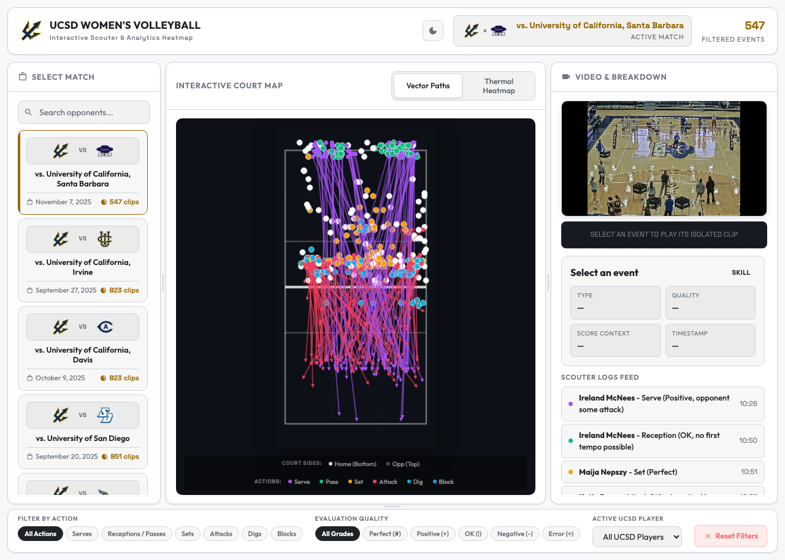

# UCSD Women's Volleyball — Setter Scouter

An interactive heatmap dashboard for scouting UCSD's setter decision-making, built for the UCSD Women's Volleyball coaching staff.

**Live Demo → [triton-vb-scouting.vercel.app](https://triton-vb-scouting.vercel.app)**



---

## What It Does

The dashboard visualizes every set made by UCSD's setter across the 2024–25 season. Coaches can:

- **Browse matches** from the sidebar — filtered by opponent, with dates and Big West logos
- **Click any zone** on the interactive court map to jump directly to that set in the video
- **Filter by setter action** — Serve (Positive), Serve (Negative), Reception, or Set (Perfect)
- **Switch heatmap views** — Vector Paths, Thermal density, or raw Scatter dots
- **Watch isolated clips** — a custom video player loads only the relevant clip, not the full match film
- **Read set breakdowns** — quality score, ball trajectory, and the resulting offensive action per set

---

## How It Works

```
dashboard_data.json
       │
       ▼
  React (Vite)          ← App.jsx renders match list, court, video panel
       │
  HTML Canvas           ← Court drawn programmatically; heatmap overlaid per filter
       │
  Custom Media Player   ← Seeks video to exact timestamp of each set
```

1. **Data** — `public/data/dashboard_data.json` contains structured set data for every match: ball position, set quality, timestamp, video path, and action type.
2. **Court Map** — rendered on `<canvas>` using real volleyball court proportions. Each dot represents one set. Clicking a dot loads that clip.
3. **Video Sync** — the player uses HTML5 `<video>` with precise `currentTime` seeking to jump to the set moment within the match film.
4. **Heatmap Modes** — Vector Paths draws arrows from serve/receive position to set position. Thermal uses a Gaussian blur kernel for density visualization.

---

## Tech Stack

| Layer | Technology |
|---|---|
| Frontend | React 19 + Vite 8 |
| Styling | CSS custom properties (light/dark theme) |
| Court rendering | HTML5 Canvas API |
| Team logos | ESPN NCAA CDN (official PNGs) |
| Deployment | Vercel |

---

## Running Locally

```bash
cd ucsd_setter_package
npm install
npm run dev
```

Open [http://localhost:5173](http://localhost:5173).

---

## Project Structure

```
ucsd_setter_package/
├── public/
│   └── data/
│       ├── dashboard_data.json   # All set data for the season
│       └── match_metadata.json   # Match dates, opponents, schedule
├── src/
│   ├── App.jsx                   # Main dashboard component
│   └── index.css                 # Theme system (light/dark)
└── vite.config.js
```

---

## Features

- **Light / Dark mode** — toggle in the top-right corner; preference is saved
- **Responsive layout** — works on tablets and desktop
- **Big West team logos** — official ESPN PNGs for all conference opponents
- **No backend required** — fully static, deploys anywhere
